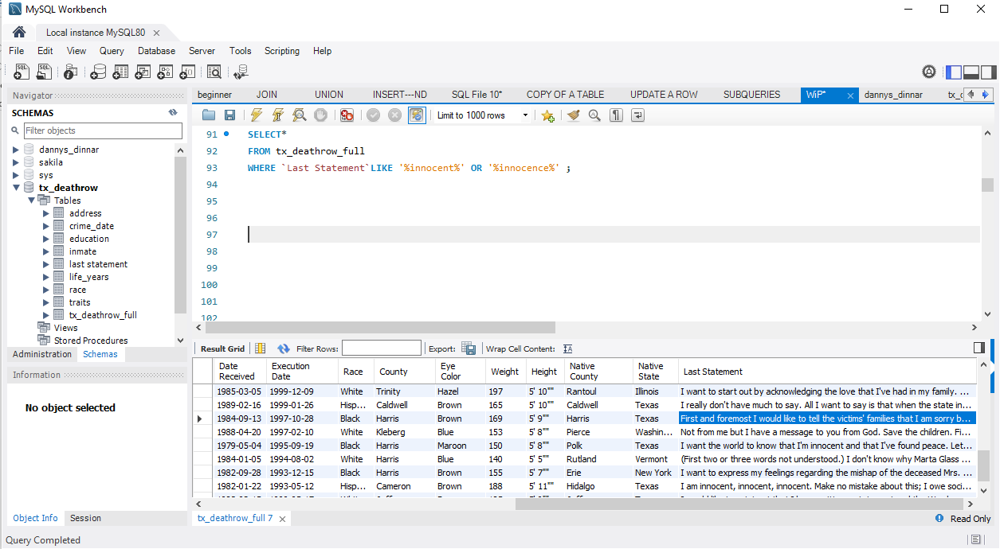
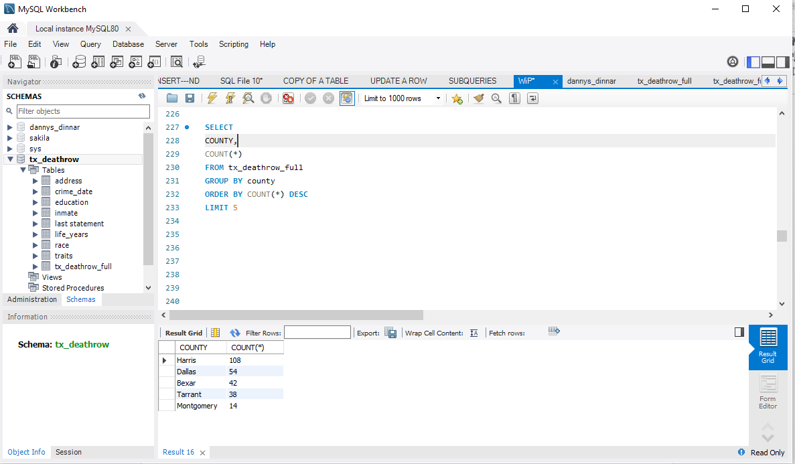

# ANALYSING-THE-TEXAS-DEATHROW

## INTRODUCTION

Document which was extracted from the Texas Department of Criminal Justice was downloaded from SelectStarSql.com, our dataset contains the death row inmates executed when the death penalty was reinstated in 1976 by the Supreme Court. The death penalty is a strongly debated issue having some of Texas population against it while some are totally in support of it.

## PROBLEM STATEMENT

Death sentence in Texas is only given for capital punishment. Hence, this dataset reveals the immense suffering of some individuals, young  lives lost, finding closure, and some cases of innocence. To understand this we query the following; 
1. Find how many inmates provided last statement
2. Find the number of inmates who have declined to give last statement  
3. Find the minimum, maximum and average age of inmate at the time of execution
4. Find the proportion of inmates with claims of innocence
5. Find the county with the highest number of execution 

## SKILLS DEMONSTRATED

Data manipulation using the **SELECT** statement

**AGGREGATE FUNCTIONS** including **ALIAS**, **GROUP BY**, **ORDER BY**

## PROBLEM SOLVING

To begin the process of providing answers to the questions asked above, I transferred the Texas death row CSV data into MySQL. From MySQL workbench, I created a new schema and then imported my csv file using the table data import wizard.

1. Find how many inmates provided last statement

To find how many inmates provided last statement, I utilized my data manipulation skills by using the **SELECT**, **COUNT (*)**, **FROM** and **WHERE** statement. The dataset contains 494 inmates out of which 402 gave their last statement. 

2. Find the number of inmates who have declined to give last statement 

I proceeded  to determine the number of inmates who have declined in giving last statement using the empty sign **‘  ‘**.

3. Find the minimum, maximum and average age of inmate at the time of execution

To query this insight, the **AGGREGATE FUNCTION** keys was put to use, the minimum (**MIN**), maximum (**MAX**) and average age (**AVG**) of inmates is determined. This shows the min age to be 24, max age is 67 and average age is 39.7 while the age at which sentence was received for the min and max inmate is 18 and 31 respectively, hence the waiting years on death row is between 6 and 36 years respectively .

4. Find the proportion of inmates with claims of innocence

The proportion of inmates with claims of innocence was captured using **LIKE** and **OR** statement. Our task here is to find how frequently this occurs by calculating the proportion of last statement where there is claims of innocence

5. Find the five county with the highest number of execution
 

The county with the highest execution is Harris at 108 inmates followed by Dallas and Bexar at 54 and 42 respectively. The **GROUP BY**, **ORDER BY** and **LIMIT** statement were put to use. The **DESC** (descending) statement gives room to get the highest execution. This was attributed to several, part of which is that judges are elected in Harris County and the population supported the death penalty.

## CONCLUSION and RECOMMENDATION

A claim of innocence even till the point of death might not connote innocence, but it is important to note those persisting till the verge of death when they have nothing else to gain. Hence the reality we are left with is that up to 5 % of the executed inmates are truly innocent.

